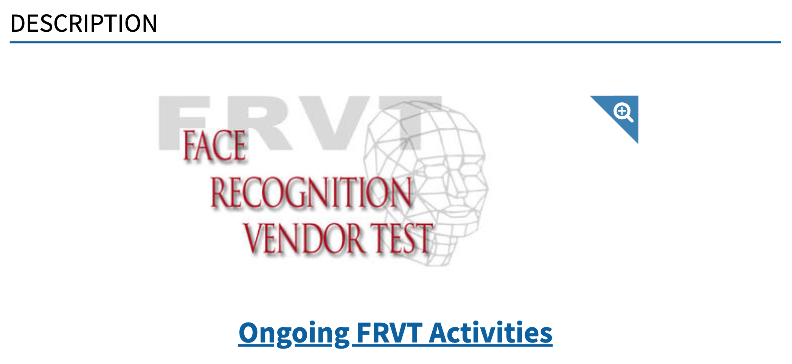
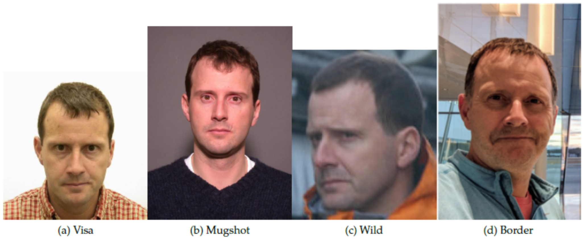
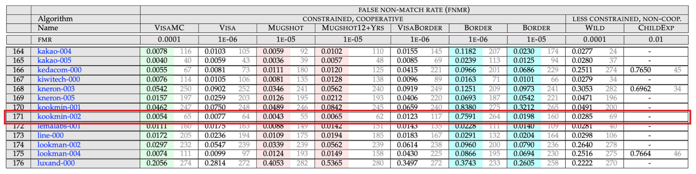

# README

## Introduction

This is a summary report for kookmin-002 algorithms which submitted to [FRVT 1:1 Verification](https://pages.nist.gov/frvt/html/frvt11.html), maintained by the US National Institute of Standards and Technology(NIST).

## Methods

Build a framework to extract n-dim facial feature from input face image to verify identification.

## Results

We submitted our submission package named as kookmin-002 on 2021 March and it ranked 65th place for VisaMC dataset, 64th place for VISA dataset, 55th place for MUGSHOT dataset and 69th place for WILD dataset. Overall, kookmin-002 algorithm earned top 20% place from 5 benchmarks among 322 entries as of June 28th 2021.

For more information, it could be downloaded from the link [here](https://github.com/usnistgov/frvt/blob/nist-pages/reports/11/frvt_11_report_2021_06_28.pdf)
